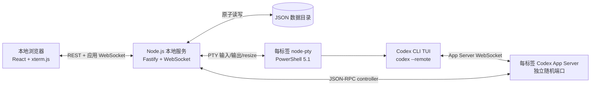
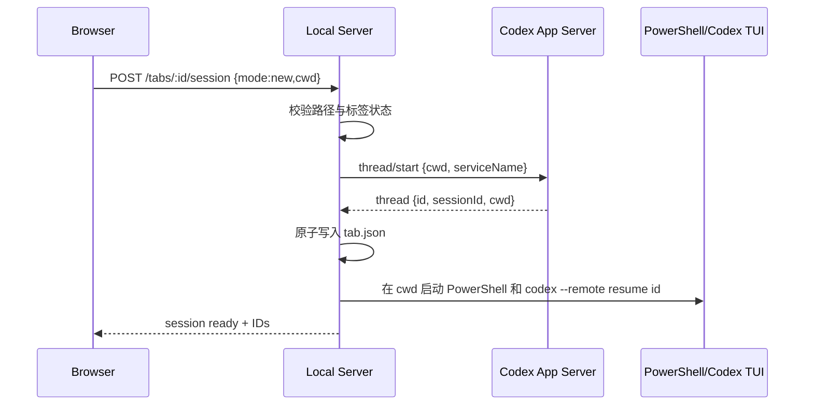
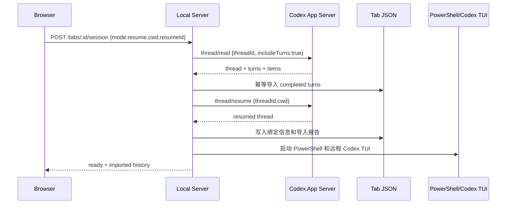
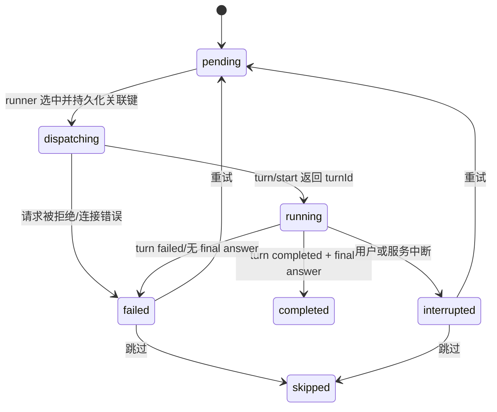
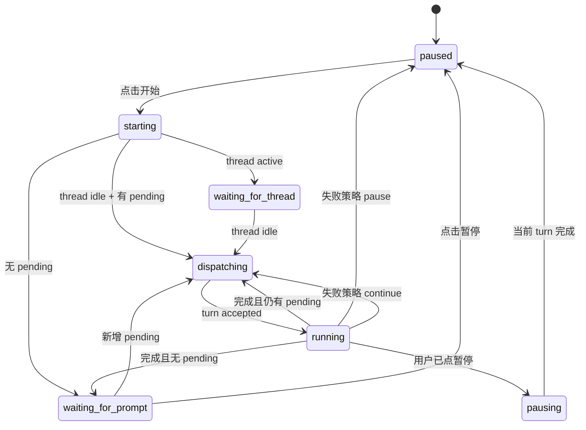

# Codex Promptor 实施设计说明

> 状态：可实施设计稿
>
> 目标平台：Windows 10/11、本机单用户
>
> 基准环境：Node.js 24、Windows PowerShell 5.1、`codex-cli 0.147.0`
> 最后更新：2026-08-21

## 1. 文档目的

本文定义一个本地 Prompt 队列工具的完整实现方案。工具在浏览器中管理多个 Codex 对话标签、对话分组、真实 PowerShell/Codex 终端、可动态调整顺序的 prompt list，以及 prompt 与 final answer 的 JSON 持久化。

本文是后续实现、测试和验收的依据。`reference/prompt_runner.py` 与 `reference/prompt_list.json` 仅用于理解原始需求，不作为新工具的运行时组成，也不要求兼容其中的文件格式。

## 2. 产品目标与范围

### 2.1 核心目标

1. 启动后打开一个只监听本机地址的网页。
2. 左侧管理可分组、可排序、可持久化的对话标签。
3. 每个标签绑定一个本地工作路径和一个 Codex 对话。
4. 标签内显示一个真实运行的 PowerShell，其中运行官方 Codex CLI 终端界面。
5. 在不拦截或改写终端输入的前提下，让自动队列向同一个 Codex 对话逐条提交 prompt。
6. 每轮开始前读取 prompt list 的最新状态，因此运行期间仍可调整尚未执行条目的内容和顺序。
7. 持久化 prompt 的开始/完成时间，以及每轮 Codex final answer。
8. 恢复旧会话时，自动导入已有的已完成 prompt 与 final answer，重复加载不产生重复记录。
9. 浏览器刷新、标签切换或前端重新连接时，不中断仍在后端运行的终端和队列。

### 2.2 第一版明确不包含

- 不提供公网访问、多用户账号、团队协作或权限体系。
- 不打包为 Electron、Tauri 或单文件 EXE。
- 不支持 Linux、macOS、WSL 内终端或远程主机。
- 不提供跨设备同步或云端数据库。
- 不解析终端屏幕文字来判断 Codex 是否完成。
- 不使用模拟键盘粘贴的方式提交自动 prompt。
- 不自动迁移当前参考 JSON 中的示例数据。
- 不自动选择模型、审批策略、沙箱模式或推理等级。

### 2.3 关键术语

| 术语 | 含义 |
| --- | --- |
| 标签（Tab） | 工具中的一个工作单元，绑定一个工作路径和一个 Codex thread。 |
| Thread ID | App Server 返回的 `thread.id`，也是本工具恢复具体对话时保存的主要标识。 |
| Session ID | App Server 返回的 `thread.sessionId`。根 thread 通常与 Thread ID 相同，分叉场景可能不同。 |
| Turn | 一次用户输入及 Codex 随后的完整处理过程。 |
| Queue turn | 由 prompt list 自动提交的 turn。 |
| Manual turn | 用户直接在 Codex TUI 中发起的 turn。 |
| Steering | 用户在一个仍在执行的 turn 中追加的输入。 |
| Final answer | turn 中最终的 agent message；优先使用 `phase: final_answer` 的消息。 |

## 3. 关键技术决策

### 3.1 使用 Codex App Server 作为唯一会话事实源

官方 OpenAI 文档将 App Server 定位为构建富客户端时使用的接口，提供会话历史、审批和流式 agent 事件；它还支持用 `codex --remote` 连接真实 CLI TUI。[Codex App Server 官方文档](https://developers.openai.com/codex/app-server)

每个打开的标签按需启动一个独立 App Server：

```powershell
codex app-server --listen ws://127.0.0.1:<random-port>
```

该标签的 controller、队列和 Codex TUI 只连接自己的进程。进程边界保证关闭标签时可以立即释放 rollout writer，也防止一个标签的异常影响其他对话。端口和 PID 只保存在内存中，不写入标签 JSON。

### 3.2 自动队列不向 PowerShell 注入按键

自动队列直接调用 App Server 的 `turn/start`。PowerShell/xterm.js 只传递用户真实键盘输入并显示真实 Codex TUI。

这样可以保证：

- 不会把自动 prompt 拼到用户尚未提交的终端草稿中。
- 多行 prompt、Unicode 和长文本不依赖 bracketed paste。
- 可通过 `turn.id`、`clientUserMessageId` 和结构化事件可靠关联结果。
- 用户仍可在 TUI 中选择模型、调整模式、审批、发起人工 turn 或 steering。

队列发起 `turn/start` 时只发送 `threadId`、`clientUserMessageId` 和 `input`，不发送 `model`、`effort`、`sandboxPolicy`、`approvalPolicy` 等覆盖项，从而沿用用户在该 thread 中设置的当前选项。

### 3.3 不使用旧脚本的 `codex exec` 轮询模型

原脚本通过 `codex exec`、`--output-last-message` 和本地 state 文件逐轮启动独立进程。这适合非交互批处理，但不能可靠地让页面内的交互 TUI、人工输入和自动队列共享实时状态。官方仍提供非交互模式，作为理解原脚本行为的参考，但不是本方案的主执行内核。[Codex 非交互模式文档](https://developers.openai.com/codex/noninteractive)

### 3.4 接受并隔离实验接口风险

官方文档明确说明 App Server 的 WebSocket transport 与远程 TUI 仍是实验能力，不支持生产工作负载。本工具因此限定为本机个人工具，并采取以下措施：

- 第一版精确支持 `codex-cli 0.147.0`。
- 启动时执行 `codex --version`，版本不一致则拒绝启动 App Server，并给出适配提示。
- 开发阶段用固定版本生成 TypeScript 协议类型并提交到代码库：

```powershell
codex app-server generate-ts --experimental --out src/server/generated/codex-app-server
```

- 升级 Codex CLI 时，必须重新生成协议类型并完成集成测试后再修改支持版本。
- 不静默回退到 `codex exec`，避免用户误以为终端和队列仍共享同一实时会话。

## 4. 总体架构



### 4.1 推荐技术栈

| 层 | 选择 | 用途 |
| --- | --- | --- |
| 语言 | TypeScript | 前后端共享类型，降低 JSON/API 漂移。 |
| 前端 | React + Vite | 本地单页应用。 |
| HTTP 服务 | Fastify | 静态资源、REST、认证和健康检查。 |
| 应用 WebSocket | `@fastify/websocket` | 终端数据和实时状态推送。 |
| Codex WebSocket | `ws` | App Server JSON-RPC controller。 |
| 终端 | `@xterm/xterm`、`@xterm/addon-fit` | 浏览器终端渲染与 resize。 |
| Windows PTY | `node-pty` | 真实 PowerShell 进程和终端控制。 |
| 拖拽 | `@dnd-kit/core`、`@dnd-kit/sortable` | 标签分组和 pending prompt 排序。 |
| 分栏 | `react-resizable-panels` | 外层和标签内分栏。 |
| 校验 | Zod | REST、WebSocket 和磁盘 JSON 统一校验。 |
| 原子写入 | `write-file-atomic` | Windows 下安全替换 JSON 文件。 |
| Markdown | `react-markdown` + `rehype-sanitize` | 安全显示 final answer。 |

依赖的具体版本由实现时生成的 `package-lock.json` 锁定。运行时基准为 Node.js 24。

### 4.2 后端模块职责

| 模块 | 职责 |
| --- | --- |
| `AppServerPool` / `AppServerManager` | 按 tabId 创建、健康检查并关闭独立 Codex App Server；聚合服务状态。 |
| `CodexRpcClient` | JSON-RPC initialize、请求关联、订阅、事件分发和 server request 响应。 |
| `ThreadRegistry` | 维护 tab 与 thread 的唯一绑定及实时 thread 状态。 |
| `HistoryImporter` | 读取已有 turns，提取 prompt/final answer 并幂等落盘。 |
| `QueueRunner` | 每标签队列状态机、动态选取下一项、失败策略和恢复。 |
| `TurnRecorder` | 汇集 user/agent items，识别 final answer，记录人工与队列 turns。 |
| `PtyManager` | 每标签 PowerShell/Codex TUI 的启动、输出缓冲、resize 和停止。 |
| `StorageService` | Zod 校验、revision、每标签锁、原子写入和 schema migration。 |
| `WorkspaceIndexService` | 分组、标签、布局和 trash 管理。 |
| `LocalAuthService` | 一次性启动令牌、cookie、Origin/Host/CSRF 校验。 |

## 5. 界面与交互设计

### 5.1 页面布局

```text
┌─────────────────┬─────────────────────────────────────────────────────────────┐
│ 对话标签侧栏    │ 当前标签                                                    │
│                 │ ┌──────────────────────────────────────┬──────────────────┐ │
│ + 新建标签      │ │ 工作区                               │ Prompt list      │ │
│ + 新建分组      │ │ ┌──────────────────────────────────┐ │ [开始] [暂停]   │ │
│                 │ │ │ 会话设置 / 状态 / 回答历史        │ │ 失败策略 ▼      │ │
│ ▾ 未分组        │ │ └──────────────────────────────────┘ │                  │ │
│   标签 A        │ │ ┌──────────────────────────────────┐ │ ① completed     │ │
│   标签 B        │ │ │ PowerShell + 真实 Codex TUI      │ │ ② running       │ │
│ ▾ 项目组        │ │ │                                  │ │ ③ pending       │ │
│   标签 C        │ │ └──────────────────────────────────┘ │ ④ pending       │ │
│                 │ └──────────────────────────────────────┴──────────────────┘ │
└─────────────────┴─────────────────────────────────────────────────────────────┘
```

- 外层侧栏与内容区可以水平拖动调宽。
- 标签内容中的工作区和 prompt list 可以水平拖动调宽。
- 状态/历史区与终端区可以垂直拖动调高。
- 所有宽度、高度和折叠状态立即持久化。
- 侧栏最小宽度 180 px，工作区最小宽度 520 px，队列最小宽度 360 px。

### 5.2 标签侧栏

- 内置“未分组”分组，不允许删除或重命名。
- 可新建、重命名、折叠、展开、排序和删除自定义分组。
- 删除分组时，其标签移动到“未分组”，不删除标签数据。
- 标签可在组内排序，也可拖到其他分组。
- 标签支持新建、重命名和删除。
- 删除标签必须二次确认；后端将标签目录移动到 `data/trash/`，不直接永久删除。
- 标签切换只改变当前视图，不停止后台终端或队列。
- 同一 Codex Thread ID 不允许绑定两个活动标签。

### 5.3 新标签的会话设置

未配置标签显示以下控件：

1. 本地路径文本框。
2. “浏览”按钮，调用后端打开 Windows 文件夹选择器。
3. 单选项：
   - 创建新对话；
   - 继续已有对话。
4. 选择“继续已有对话”时显示 resume ID 输入框。
5. “确定”按钮。

路径校验规则：

- 必须是存在的绝对目录。
- 后端使用 `realpath` 得到规范化路径。
- Windows 路径比较不区分大小写，并去除无意义的尾部分隔符。
- 不自动创建不存在的工作目录。
- 不要求目录必须是 Git 仓库；若 Codex 自身要求信任或确认，由真实 TUI 处理。

标签一旦成功绑定 thread，就不能直接切换到另一个 thread。要使用另一会话，应新建标签；这样可以避免历史文件混用。

### 5.4 状态与回答历史区

成功初始化后显示：

```text
已创建/已继续在 D:\path\to\project 中的对话
Thread ID: 019...
Session ID: 019...                 [复制]
Codex: 已连接 | Terminal: 运行中 | Queue: 已暂停
```

- 当 Thread ID 和 Session ID 相同，只重点展示一个“恢复 ID”；不同则都展示。
- 展示当前 turn 来源、prompt 摘要、开始时间、耗时和 waiting-on-approval 等状态。
- 下方是可滚动的回答历史，最新记录默认展开，旧记录可折叠。
- 每条记录展示来源徽标：`队列`、`人工`、`导入`。
- final answer 以安全 Markdown 渲染，提供“复制原文”。
- 导入历史时显示导入数量、跳过数量及警告。

### 5.5 真实 PowerShell/Codex 终端

- 后端通过 `node-pty` 启动 `powershell.exe -NoLogo -NoExit`，并把 PTY 的 `cwd` 直接设置为标签工作路径。
- PowerShell 启动后，后端发送一条仅由受控值组成的命令：

```powershell
codex --remote ws://127.0.0.1:<app-server-port> --no-alt-screen resume <thread-id>
```

- `thread-id` 必须先通过 UUID 校验；工作路径不拼进命令字符串。
- xterm.js 的键盘输入原样写入 PTY，工具不拦截普通按键、不替换 slash command、不改变模型选择。
- 浏览器只要仍连接后端，用户即可正常使用 Codex TUI，包括模型选择、模式切换、审批、人工提问和 steering。
- 浏览器首次附着时接收一次有限 snapshot；WebSocket 重连携带 `generation + nextOffset`，只补发缺失字节。缓存代次变化或游标过旧时才明确 reset。
- `ResizeObserver` 只在 xterm 行列数实际变化时调整 PTY；连接建立不强制抢占焦点。TUI 的 DECSET 12 光标闪烁请求由前端消费，以保持稳定光标。
- 终端输出默认不写入磁盘，避免保存 token、路径、命令输出或其他敏感内容。
- Codex TUI 退出后 PowerShell 保持打开，标签标记为“Codex 已退出”，自动队列软暂停。用户可点击“重新打开 Codex”。

### 5.6 Prompt list

队列右栏包含：

- 开始按钮。
- 暂停按钮。
- 失败策略选择：
  - 失败并暂停（默认）；
  - 记录失败后继续。
- 新增 prompt 按钮。
- prompt 条目列表。

条目操作规则：

| 状态 | 样式 | 可编辑 | 可拖动 | 可删除 | 其他操作 |
| --- | --- | --- | --- | --- | --- |
| `pending` | 正常 | 是 | 是，仅在 pending 间 | 是 | 插入前/后 |
| `dispatching` | 蓝色 | 否 | 否 | 否 | 无 |
| `running` | 高亮/动画 | 否 | 否 | 否 | 可从 TUI 人工 steering |
| `completed` | 灰色 | 否 | 否 | 否 | 查看回答 |
| `failed` | 红色 | 否 | 否 | 否 | 重试、跳过 |
| `interrupted` | 橙色 | 否 | 否 | 否 | 重试、跳过 |
| `skipped` | 灰色删除线 | 否 | 否 | 否 | 查看原因 |

完成历史按 `completedAt` 从旧到新显示在列表顶部。人工和导入的已完成 prompt 也属于该历史区。`pending` 是唯一可重排区域。

“重试”会增加一次 attempt，将条目设回 `pending` 并放到 pending 区首位；“跳过”把条目设为 `skipped` 并移入历史区。

## 6. 应用生命周期

### 6.1 启动流程

1. `start.ps1` 检查是否已有实例。
2. 服务获得数据目录的独占进程锁。
3. 读取并校验 `data/index.json` 与各标签文件。
4. 将进程重启前遗留的 `ready/connecting` 标签恢复为 `closed`，终端设为 stopped，队列设为 paused。
5. 启动 Fastify，只监听 `127.0.0.1` 随机端口。
6. 生成一次性浏览器令牌，打开默认浏览器。
7. 用户创建或重新打开对话时，才为该标签选择空闲端口、启动 App Server、连接 controller 并启动远程 TUI。

### 6.2 创建新对话



`thread/start` 不附带初始 prompt。这样用户可先在真实 TUI 中选择模型或模式，再点击队列“开始”。

### 6.3 恢复已有对话并导入历史



如果 `thread/read` 或 `thread/resume` 失败，不写入 session 绑定，也不启动终端；页面保留用户输入并显示可重试错误。

### 6.4 关闭与重新打开对话

关闭顺序固定为：暂停队列并中断活动 turn、终止该标签的 PowerShell/Codex TUI 完整进程树、关闭 controller、终止该标签的 App Server 完整进程树、确认端口释放，最后写入 `session.state=closed`。关闭成功后，外部 `codex resume <thread-id>` 必须可以立即取得 writer。

关闭状态不使用遮罩或 `inert`：历史和终端画面仍可查看，所有对话页写操作原位禁用并变灰，只有“重新打开终端”可用。重新打开时创建新的独立 App Server；若外部 Codex 正持有 writer，返回 `SESSION_ACTIVE_WRITER` 并保持关闭，不遗留新进程。

### 6.5 队列调度流程

每标签只有一个 `QueueRunner` 和一个异步互斥锁。

```text
while desiredState == running:
    若 thread 不是 idle：等待状态变化
    从磁盘重新读取、校验 prompt-list.json
    选择当前 pending 顺序中的第一项
    若不存在：进入 waiting，等待文件或 UI 变更
    持久化 dispatching + clientUserMessageId + 新 attempt
    调用 turn/start
    持久化 running + codexTurnId + startedAt
    等待对应 turn/completed
    成功：先写 final-answers.json，再把 prompt 标为 completed
    失败/中断：写 prompt 错误并应用标签失败策略
```

`clientUserMessageId` 格式：

```text
codex-promptor:<tabId>:<promptId>:<attemptNo>
```

此值既用于识别队列 turn，也用于在“请求已发出但进程在收到 turn ID 前崩溃”的情况下恢复关联。

### 6.6 动态顺序语义

- 点击“开始”不会创建 prompt list 快照。
- 当前运行项结束后，runner 必须重新从磁盘加载文件。
- 后续执行项由当时数组中第一个 `pending` 决定。
- 运行期间修改、插入、删除或拖动 pending 项，会影响下一轮。
- 如果文件被外部编辑成无效 JSON 或不符合 schema，runner 暂停并显示校验错误，绝不覆盖坏文件。

### 6.7 暂停语义

- 点击“暂停”只把 `desiredState` 设为 `paused`。
- 已经执行的 turn 不调用 `turn/interrupt`，继续等待它正常完成并保存结果。
- 完成后不再调度下一条。
- 用户在 TUI 中主动中断 turn 时，队列项进入 `interrupted`，然后应用失败策略。

### 6.8 无待执行项

- 每轮完成后重新读取列表；没有 pending 项时自动把 `desiredState` 和状态持久化为 paused。
- 在最后一轮执行期间新增的 pending 项仍会被下一轮读取并执行，直至真正清空后才暂停。
- 在 ready 对话中添加第一条 pending prompt 会自动启动队列。

### 6.9 人工输入与自动队列共存

- controller 订阅绑定 thread 的全部 `turn/*` 与 `item/*` 事件。
- `clientUserMessageId` 匹配本工具格式的 turn 归类为 queue；其他 turn 归类为 manual。
- 如果用户在队列准备提交前先发起 manual turn，thread 会变为 active，runner 等待其结束。
- 如果用户在 queue turn 运行中 steering，追加输入属于同一个 turn：
  - 不新建 prompt list 条目；
  - 保留原队列 prompt；
  - 在 answer 的 `promptSnapshot.steeringInputs` 中记录追加输入；
  - final answer 仍关联原 queue prompt。
- 独立 manual turn 完成后，会生成一条 `origin: manual` 的灰色完成 prompt 和对应 answer。

### 6.10 多标签并行

- 不同标签、不同 thread 可同时运行。
- 同一路径的多个标签允许同时运行，但 UI 持续显示冲突警告。
- 同一路径警告使用规范化后的 Windows 路径判断。
- 每标签的队列锁和文件锁互相独立。
- `data/index.json` 使用单独全局锁。
- 同一 Thread ID 只能由一个活动标签占用；第二次绑定直接返回 `THREAD_ALREADY_BOUND`。

## 7. Codex App Server 协议适配

### 7.1 连接与初始化

每个 WebSocket transport 只初始化一次：

```json
{
  "method": "initialize",
  "id": 1,
  "params": {
    "clientInfo": {
      "name": "codex_promptor",
      "title": "Codex Promptor",
      "version": "0.1.0"
    },
    "capabilities": {
      "experimentalApi": true
    }
  }
}
```

收到成功响应后发送：

```json
{"method":"initialized","params":{}}
```

请求 ID 由单调递增的安全整数生成；pending request map 必须支持超时、连接关闭时统一 reject，以及忽略未知 notification。

### 7.2 使用的方法

| 方法 | 用途 |
| --- | --- |
| `thread/start` | 创建空的新对话。 |
| `thread/read` | 不恢复 thread 的情况下读取 metadata 和历史 turns。 |
| `thread/resume` | 恢复并订阅已有 thread。 |
| `thread/loaded/list` | 重连时辅助检查已加载 thread。 |
| `thread/unsubscribe` | 仅用于普通取消订阅；不能代替关闭，因为最后一个订阅者离开后仍有保留期。 |
| `turn/start` | 自动提交 prompt。 |
| `turn/interrupt` | 关闭对话时中断队列或人工活动 turn；普通队列不提供手动中断按钮。 |

### 7.3 关键事件

| 事件 | 处理 |
| --- | --- |
| `thread/status/changed` | 更新 idle/active/waitingOnApproval 状态并唤醒 runner。 |
| `turn/started` | 创建内存 turn accumulator，保存开始时间。 |
| `item/started` | 展示命令、工具等活动状态，不作为最终数据。 |
| `item/completed` | 保存权威 item，收集 userMessage、agentMessage 和 plan。 |
| `item/agentMessage/delta` | 只用于实时预览，不用于最终落盘。 |
| `turn/completed` | 依据最终 status 完成记录或标记失败。 |
| `serverRequest/resolved` | 清除网页中的备用审批/输入卡。 |
| `error`、`warning` | 记录诊断信息并按 thread/turn 范围展示。 |

不得假设事件只会按理想顺序到达。处理器应满足：

- 收到重复事件时幂等。
- `turn/completed` 到达时若缺少部分 item，主动调用 `thread/read(includeTurns=true)` 对账。
- 未知 event 类型只写诊断日志，不使连接崩溃。
- 所有事件必须先按 `threadId` 路由到正确标签。

### 7.4 Final answer 选择算法

对状态为 `completed` 的 turn：

1. 收集该 turn 的所有完成 `agentMessage`。
2. 选择最后一条 `phase == "final_answer"` 且 `text.trim()` 非空的消息。
3. 如果没有，选择最后一条 `phase == null` 且非空的 agent message，并设置 `captureMode: "fallback_last_agent_message"`。
4. 如果仍没有，选择最后一个非空 plan item，并设置 `captureMode: "fallback_plan"`。
5. 如果没有任何可用文本：
   - queue prompt 标记为 `failed`，错误码 `NO_FINAL_ANSWER`；
   - manual/imported turn 不生成 answer，仅计入导入/同步警告。

保存的是 `item/completed` 中的完整文本，不是 delta 拼接文本。

### 7.5 审批与用户输入请求

自动 turn 由 controller 发起时，App Server 的 server request 可能到达 controller 连接。后端必须：

1. 将请求保存到内存 pending map。
2. 通过应用 WebSocket 推送“待处理卡片”。
3. 允许用户在网页中提交协议允许的决定或输入。
4. 若真实 Codex TUI 已经处理并收到 `serverRequest/resolved`，立即关闭网页卡片。
5. 对重复响应返回“请求已解决”，不重复发送 JSON-RPC response。

不得自动批准命令、文件修改、网络访问或 MCP 请求。

## 8. 数据目录与文件职责

```text
codex_promptor/
├─ docs/
│  └─ IMPLEMENTATION_SPEC.md
├─ setup.ps1
├─ start.ps1
├─ package.json
├─ package-lock.json
├─ config/
│  ├─ tsconfig.client.json
│  ├─ tsconfig.server.json
│  ├─ vite.config.ts
│  └─ vitest.config.ts
├─ src/
├─ data/
│  ├─ index.json
│  ├─ .instance.lock
│  ├─ tabs/
│  │  └─ <tab-uuid>/
│  │     ├─ tab.json
│  │     ├─ prompt-list.json
│  │     ├─ final-answers.json
│  │     └─ runtime.json
│  ├─ backups/
│  └─ trash/
└─ reference/
   ├─ prompt_runner.py    # 参考文件，不参与运行
   └─ prompt_list.json    # 参考文件，不参与运行
```

“一个标签创建一个文件”在实现中明确为“一个标签创建一个独立数据目录”。这是因为 prompt list、final answer 和运行检查点必须保持职责分离。

### 8.1 通用 JSON 规则

- 编码为 UTF-8，无 BOM。
- 时间统一为 UTC ISO 8601，例如 `2026-08-21T10:20:30.123Z`。
- 所有顶层文件包含 `schemaVersion` 和 `revision`。
- `revision` 每次成功写入递增 1。
- 读取时先 parse，再通过 Zod 校验；校验失败不自动覆盖。
- 写入使用同目录临时文件、flush 和原子替换。
- schema migration 前在 `data/backups/` 创建时间戳备份。

## 9. JSON 数据契约

以下示例是第一版的规范格式。实现中的 Zod schema 与 TypeScript 类型必须由同一源定义。

### 9.1 `data/index.json`

```json
{
  "schemaVersion": 1,
  "revision": 12,
  "activeTabId": "c24b9ca8-fbef-4d09-b6fe-bab50cbe2c53",
  "layout": {
    "sidebarWidthPx": 260
  },
  "groups": [
    {
      "id": "ungrouped",
      "name": "未分组",
      "order": 0,
      "collapsed": false,
      "system": true
    },
    {
      "id": "20a9bb0a-dbc1-4c1c-b636-2b749864c8ca",
      "name": "项目 A",
      "order": 1,
      "collapsed": false,
      "system": false
    }
  ],
  "tabs": [
    {
      "id": "c24b9ca8-fbef-4d09-b6fe-bab50cbe2c53",
      "name": "重构任务",
      "groupId": "20a9bb0a-dbc1-4c1c-b636-2b749864c8ca",
      "order": 0,
      "dataDirectory": "tabs/c24b9ca8-fbef-4d09-b6fe-bab50cbe2c53",
      "createdAt": "2026-08-21T09:00:00.000Z",
      "updatedAt": "2026-08-21T09:10:00.000Z"
    }
  ]
}
```

约束：

- `ungrouped` 永远存在且 `system: true`。
- group 和 tab 的 `order` 在各自作用域内连续，从 0 开始。
- `dataDirectory` 必须是 `data/` 下的安全相对路径。
- `activeTabId` 可以是 `null`，但若非空必须引用现存标签。

### 9.2 每标签 `tab.json`

```json
{
  "schemaVersion": 1,
  "revision": 8,
  "tabId": "c24b9ca8-fbef-4d09-b6fe-bab50cbe2c53",
  "session": {
    "state": "ready",
    "mode": "resume",
    "workingDirectory": "D:\\work\\project-a",
    "sourceWorkingDirectory": "D:\\work\\project-a",
    "codexThreadId": "0198dabc-1234-7abc-8def-0123456789ab",
    "codexSessionId": "0198dabc-1234-7abc-8def-0123456789ab",
    "codexCliVersion": "0.147.0",
    "boundAt": "2026-08-21T09:01:00.000Z",
    "lastHistorySyncAt": "2026-08-21T09:01:02.000Z"
  },
  "queueConfig": {
    "onFailure": "pause"
  },
  "layout": {
    "queueWidthPercent": 36,
    "statusHeightPx": 260
  },
  "createdAt": "2026-08-21T09:00:00.000Z",
  "updatedAt": "2026-08-21T09:10:00.000Z"
}
```

`session.state`：`unconfigured | connecting | ready | error`。`queueConfig.onFailure`：`pause | continue`。

### 9.3 每标签 `prompt-list.json`

```json
{
  "schemaVersion": 1,
  "revision": 31,
  "prompts": [
    {
      "id": "b2bbce58-bbfc-4b34-a67f-532026b52edf",
      "origin": "imported",
      "text": "检查当前项目结构。",
      "inputSnapshot": [
        {
          "type": "text",
          "text": "检查当前项目结构。"
        }
      ],
      "status": "completed",
      "createdAt": "2026-08-20T06:00:00.000Z",
      "startedAt": "2026-08-20T06:00:00.000Z",
      "completedAt": "2026-08-20T06:04:00.000Z",
      "codexTurnId": "0198dabd-2345-7bcd-8efa-123456789abc",
      "clientUserMessageId": null,
      "attempts": [],
      "lastError": null
    },
    {
      "id": "93767419-c19e-4e18-8da0-b19e55efc351",
      "origin": "queue",
      "text": "运行测试并总结失败原因。",
      "inputSnapshot": [
        {
          "type": "text",
          "text": "运行测试并总结失败原因。"
        }
      ],
      "status": "pending",
      "createdAt": "2026-08-21T09:05:00.000Z",
      "startedAt": null,
      "completedAt": null,
      "codexTurnId": null,
      "clientUserMessageId": null,
      "attempts": [],
      "lastError": null
    }
  ]
}
```

Prompt 字段：

| 字段 | 说明 |
| --- | --- |
| `id` | 工具生成的 UUID。 |
| `origin` | `queue | manual | imported`。 |
| `text` | UI 展示的主文本。 |
| `inputSnapshot` | 结构化输入快照；可包含 text、image、localImage、skill、mention 等描述。 |
| `status` | `pending | dispatching | running | completed | failed | interrupted | skipped`。 |
| `createdAt` | 本工具创建或导入此记录的业务时间；导入时优先使用 turn startedAt。 |
| `startedAt` | 最新一次执行开始时间。 |
| `completedAt` | 成功完成或导入完成的时间；失败时为 `null`。 |
| `codexTurnId` | 当前/成功 attempt 对应的 Codex turn ID。 |
| `clientUserMessageId` | queue attempt 的稳定关联键；人工/导入可为 `null`。 |
| `attempts` | 队列执行尝试的完整审计记录。 |
| `lastError` | 最新失败信息；成功或未执行时为 `null`。 |

Attempt 示例：

```json
{
  "attemptNo": 2,
  "clientUserMessageId": "codex-promptor:c24b...:9376...:2",
  "codexTurnId": "0198dabd-2345-7bcd-8efa-123456789abc",
  "status": "failed",
  "startedAt": "2026-08-21T09:20:00.000Z",
  "endedAt": "2026-08-21T09:21:00.000Z",
  "error": {
    "code": "USAGE_LIMIT_EXCEEDED",
    "message": "Codex usage limit exceeded.",
    "retryable": true
  }
}
```

### 9.4 每标签 `final-answers.json`

```json
{
  "schemaVersion": 1,
  "revision": 19,
  "answers": [
    {
      "id": "63f6fe60-4368-41d6-8144-f0200344d156",
      "promptId": "b2bbce58-bbfc-4b34-a67f-532026b52edf",
      "source": "imported",
      "codexThreadId": "0198dabc-1234-7abc-8def-0123456789ab",
      "codexTurnId": "0198dabd-2345-7bcd-8efa-123456789abc",
      "promptSnapshot": {
        "primaryText": "检查当前项目结构。",
        "inputs": [
          {
            "type": "text",
            "text": "检查当前项目结构。"
          }
        ],
        "steeringInputs": []
      },
      "finalAnswer": "项目包含……",
      "answerItemId": "0198dabe-3456-7cde-8fab-23456789abcd",
      "captureMode": "phase_final_answer",
      "startedAt": "2026-08-20T06:00:00.000Z",
      "completedAt": "2026-08-20T06:04:00.000Z",
      "recordedAt": "2026-08-21T09:01:01.000Z"
    }
  ]
}
```

约束：

- `(codexThreadId, codexTurnId)` 在文件内唯一。
- `promptId` 必须引用 `prompt-list.json` 中的一条记录。
- 保存 prompt 快照，确保即使未来新增迁移逻辑，也不会改变历史回答对应的原输入。
- `captureMode` 为：
  - `phase_final_answer`；
  - `fallback_last_agent_message`；
  - `fallback_plan`。
- answers 按 `completedAt` 升序存储；时间为 `null` 的导入记录放在有时间记录之后，并保持 Codex 原 turn 顺序。

### 9.5 每标签 `runtime.json`

```json
{
  "schemaVersion": 1,
  "revision": 44,
  "runner": {
    "desiredState": "paused",
    "state": "paused",
    "activePromptId": null,
    "activeTurnId": null,
    "lastError": null,
    "lastTransitionAt": "2026-08-21T09:10:00.000Z"
  },
  "terminal": {
    "state": "running",
    "lastExitCode": null,
    "lastStartedAt": "2026-08-21T09:01:03.000Z"
  },
  "reconciliation": {
    "required": false,
    "lastCompletedAt": "2026-08-21T09:01:02.000Z"
  }
}
```

`runner.state`：

```text
paused | starting | waiting_for_thread | dispatching | running |
waiting_for_prompt | pausing | error
```

进程 PID、App Server port、浏览器连接数和终端滚动缓冲不持久化；这些值跨进程无效。

## 10. 历史导入算法

### 10.1 导入范围

- 导入目标 thread 自身的 turns，不自动导入 fork、subagent 或 descendant thread。
- 只导入 `status == completed` 的 turn。
- turn 必须同时具备至少一个可表示的用户输入和一个可提取的 final answer。
- `failed`、`interrupted` 或没有 answer 的历史 turn 计入导入报告，但不创建完成记录。

### 10.2 Prompt 提取

按 turn items 的原始顺序处理所有 `userMessage`：

- text：保留原文。
- image：保存 URL 描述，不下载。
- localImage：保存路径描述。
- skill：保存 skill 名称和路径。
- mention：保存 app/mention 名称和路径。
- 其他未来输入类型：保存 `{type, unsupported: true}`，同时生成可读占位文字。

用于列表显示的 `text`：

- 第一段 text 作为主 prompt。
- 后续独立 userMessage 用分隔符 `\n\n--- 追加输入 ---\n\n` 连接。
- 只有非文本输入时，使用诸如 `[localImage: D:\\a.png]` 的可读描述。

### 10.3 幂等与修复

对每个历史 turn：

1. 以 `(threadId, turnId)` 查找 answer。
2. 以 `codexTurnId` 查找 prompt。
3. 两者都存在：跳过，不覆盖用户本地记录。
4. prompt 存在、answer 缺失：补建 answer。
5. answer 存在、prompt 缺失：使用 answer 中的 `promptId` 补建 prompt。
6. 两者都缺失：生成新 UUID，先写 answer 数据草稿，再在同一个标签写锁中完成两个文件。

恢复会话时执行全量同步；App Server 或应用异常重连后也执行一次同步。数据规模过大时可在未来改用 turn 分页，但第一版以 `thread/read(includeTurns=true)` 为准。

### 10.4 时间字段

- `startedAt` 使用 Codex turn 的 `startedAt`。
- `completedAt` 使用 Codex turn 的 `completedAt`。
- 协议时间为 Unix 秒时转换为 UTC ISO 字符串。
- 字段不存在时保存 `null`，禁止用导入时间伪装成对话时间。
- `recordedAt` 始终是本工具写入记录的当前 UTC 时间。

## 11. 队列状态机

### 11.1 Prompt 状态转换



`completed` 和 `skipped` 是终态；第一版 UI 不提供重置。

### 11.2 Runner 状态转换



## 12. REST API 契约

所有响应使用 JSON。成功响应为 `{ "data": ... }`；错误响应为：

```json
{
  "error": {
    "code": "PROMPT_REVISION_CONFLICT",
    "message": "Prompt list has changed.",
    "details": {},
    "retryable": true
  }
}
```

写操作必须带 CSRF header。涉及已有文件的修改还必须带 `If-Match: <revision>`。

### 12.1 启动与目录

| Method | Path | 说明 |
| --- | --- | --- |
| `GET` | `/api/bootstrap` | index、标签摘要、版本、服务状态和 CSRF token。 |
| `GET` | `/api/health` | 本地服务健康检查。 |
| `POST` | `/api/dialog/select-directory` | 打开 Windows 文件夹选择器并返回绝对路径。 |

文件夹选择器由后端启动固定 PowerShell `-STA -NoProfile` 脚本，使用 `System.Windows.Forms.FolderBrowserDialog`。该接口不接受 shell 文本参数。

### 12.2 分组与标签

| Method | Path | 说明 |
| --- | --- | --- |
| `POST` | `/api/groups` | 新建分组。 |
| `PATCH` | `/api/groups/:groupId` | 重命名、折叠或调整顺序。 |
| `DELETE` | `/api/groups/:groupId` | 删除分组并移动其中标签。 |
| `POST` | `/api/tabs` | 新建未配置标签及数据目录。 |
| `PATCH` | `/api/tabs/:tabId` | 重命名、移动分组、调整顺序或布局。 |
| `DELETE` | `/api/tabs/:tabId` | 停止运行资源并移动到 trash。 |
| `GET` | `/api/tabs/:tabId` | 获取标签完整快照。 |

### 12.3 会话与终端

| Method | Path | 说明 |
| --- | --- | --- |
| `POST` | `/api/tabs/:tabId/session` | 创建或恢复 thread。 |
| `POST` | `/api/tabs/:tabId/history/sync` | 手工触发历史对账。 |
| `POST` | `/api/tabs/:tabId/terminal/reopen` | 在既有 thread 上重新打开 Codex TUI。 |

创建/恢复 body：

```json
{
  "mode": "resume",
  "workingDirectory": "D:\\work\\project-a",
  "resumeId": "0198dabc-1234-7abc-8def-0123456789ab"
}
```

### 12.4 Prompt 与 runner

| Method | Path | 说明 |
| --- | --- | --- |
| `POST` | `/api/tabs/:tabId/prompts` | 新建 pending prompt，可指定 beforeId/afterId。 |
| `PATCH` | `/api/tabs/:tabId/prompts/:promptId` | 编辑 pending prompt。 |
| `DELETE` | `/api/tabs/:tabId/prompts/:promptId` | 删除 pending prompt。 |
| `PUT` | `/api/tabs/:tabId/prompts/order` | 提交所有 pending ID 的新顺序。 |
| `POST` | `/api/tabs/:tabId/runner/start` | 开始或继续队列。 |
| `POST` | `/api/tabs/:tabId/runner/pause` | 软暂停。 |
| `PATCH` | `/api/tabs/:tabId/runner/config` | 设置 `onFailure`。 |
| `POST` | `/api/tabs/:tabId/prompts/:promptId/retry` | 失败项重试。 |
| `POST` | `/api/tabs/:tabId/prompts/:promptId/skip` | 失败项跳过。 |

`PUT .../order` 必须提交当前所有 pending ID，不能包含非 pending、重复或未知 ID。否则整个请求失败，不做部分排序。

## 13. 应用 WebSocket 契约

浏览器只连接本地服务，不直接连接 Codex App Server。

### 13.1 Client → Server

```ts
type TerminalCursor = { generation: string | null; nextOffset: number | null };
type ClientMessage =
  | { type: "subscribe"; tabIds: string[]; terminals?: Record<string, TerminalCursor> }
  | { type: "terminal.sync"; tabId: string; cursor: TerminalCursor }
  | { type: "terminal.input"; tabId: string; dataBase64: string }
  | { type: "terminal.resize"; tabId: string; cols: number; rows: number }
  | { type: "approval.respond"; tabId: string; requestKey: string; response: unknown }
  | { type: "snapshot.request"; tabId: string; afterSequence?: number };
```

### 13.2 Server → Client

```ts
type ServerMessage =
  | { type: "snapshot"; tabId: string; sequence: number; data: TabSnapshot }
  | { type: "tab.changed"; tabId: string; sequence: number; patch: unknown }
  | { type: "runner.changed"; tabId: string; sequence: number; runner: RunnerState }
  | { type: "turn.changed"; tabId: string; sequence: number; turn: TurnView }
  | { type: "answer.added"; tabId: string; sequence: number; answer: AnswerRecord }
  | { type: "terminal.output"; tabId: string; sequence: number; generation: string; startOffset: number; endOffset: number; reset: boolean; dataBase64: string }
  | { type: "terminal.state"; tabId: string; sequence: number; state: TerminalState }
  | { type: "approval.request"; tabId: string; sequence: number; request: ApprovalView }
  | { type: "approval.resolved"; tabId: string; sequence: number; requestKey: string }
  | { type: "error"; tabId?: string; sequence?: number; error: ApiError };
```

终端字节以 Base64 包在 JSON 消息中，确保控制序列和 Unicode 不被错误转换。客户端丢弃已经消费的重叠区间；发现 gap 时发送 `terminal.sync`，服务端按游标补发或返回一次 reset snapshot。

每标签维护递增 `sequence`。浏览器发现序号跳跃时请求 snapshot，而不是猜测遗漏状态。

## 14. 持久化、并发与崩溃恢复

### 14.1 锁顺序

固定获取顺序，防止死锁：

1. 全局 index 锁（仅涉及 group/tab metadata 时）。
2. tab 锁。
3. prompt-list 写锁。
4. final-answers 写锁。
5. runtime 写锁。

普通 queue turn 不获取 index 锁。

### 14.2 Turn 完成写入顺序

Queue turn 成功时：

1. 从 `item/completed`/历史对账获得权威 final answer。
2. 在 tab 锁内重新读取两个 JSON 并检查是否已记录 turn ID。
3. 写入 `final-answers.json`。
4. 把对应 prompt/attempt 标为 completed，写入 `prompt-list.json`。
5. 清理 `runtime.active*` 并写入 `runtime.json`。
6. 释放锁后广播状态。

先写 answer 的原因是：如果步骤 4 前崩溃，answer 中仍保留 `promptId` 和 turn ID；重启对账可以安全完成 prompt。反过来若 prompt 已显示完成但 answer 丢失，用户会看到不可解释的数据缺口。

### 14.3 Dispatch 崩溃窗口

`turn/start` 前必须先持久化：

- prompt = `dispatching`；
- attempt；
- `clientUserMessageId`。

收到响应后再保存 `turnId`。若调用成功但响应尚未持久化就崩溃，历史中的 `userMessage.clientId` 可重新关联到该 attempt，禁止重复提交。

### 14.4 启动对账

对每个已配置标签：

1. 强制 `desiredState = paused`。
2. 校验 prompt/answer 交叉引用。
3. 若存在 `dispatching/running`：读取 thread 历史。
4. 按 `clientUserMessageId` 或 `codexTurnId` 查找真实 turn：
   - 已完成且有 answer：补齐为 completed；
   - 已失败/中断：更新状态；
   - 未找到：标为 interrupted，错误码 `RECOVERY_TURN_NOT_FOUND`；
   - 仍 active：订阅并等待，但完成后仍保持队列 paused。
5. 执行历史增量同步。

### 14.5 App Server 断开

- 立即把所有 runner 标为 waiting/error，并停止新调度。
- 当前 turn 不凭连接中断直接判定失败。
- App Server 自动重启最多 3 次，使用指数退避。
- 重连后先 resume/read 对账，再决定 turn 的真实状态。
- 终端远程 TUI 已退出时不自动向 PowerShell 重复写命令；要求用户点击“重新打开 Codex”。
- 无论恢复结果如何，队列保持 paused，必须由用户再次点击开始。

## 15. 安全与隐私

本工具拥有用户级 PowerShell 权限，安全边界必须按“本机高权限服务”处理。

### 15.1 网络边界

- HTTP 和 App Server 都只绑定 `127.0.0.1`。
- 禁止配置 `0.0.0.0`。
- App Server 端口不暴露给浏览器 JavaScript。
- Fastify 拒绝非预期 Host 和 Origin。
- WebSocket upgrade 同样校验认证 cookie 和 Origin。

### 15.2 浏览器认证

1. 启动时生成 256-bit 随机一次性 token。
2. 浏览器打开 `/?bootstrapToken=<token>`。
3. 服务验证后设置 HttpOnly、SameSite=Strict、短生命周期 session cookie。
4. 立即 302 到不含 token 的 `/`。
5. 所有写请求使用独立 CSRF token。

### 15.3 命令和路径安全

- 后端不提供“执行任意命令”的 REST API。
- PowerShell executable 和参数数组固定。
- 工作路径通过 `node-pty` 的 `cwd` 传入，不通过 `-Command "cd ..."` 拼接。
- Thread ID 必须匹配 UUID 格式后才能进入固定 Codex 命令。
- 标签数据目录只允许 UUID 名称，所有磁盘路径在操作前验证仍位于 `data/` 下。
- 前端 final answer 禁用原始 HTML并经过 sanitize。

### 15.4 数据隐私

- 保存 prompt、final answer、路径、时间和错误信息。
- 不保存 reasoning、命令完整输出、工具增量或终端滚动内容。
- 诊断日志不得写认证 token、cookie、完整 prompt 或 final answer。
- 删除标签使用可恢复 trash；永久清理 trash 必须是未来的显式功能。

## 16. 错误处理矩阵

| 场景 | 行为 | 是否自动继续 |
| --- | --- | --- |
| Codex 版本不匹配 | 服务启动失败并给出要求版本。 | 否 |
| App Server 启动超时 | 重试最多 3 次，仍失败则服务只显示诊断页。 | 否 |
| 无效工作路径 | 拒绝初始化，保留表单。 | 否 |
| 无效 resume ID | 不绑定标签、不启动终端。 | 否 |
| 同一 thread 已绑定 | 返回 `THREAD_ALREADY_BOUND`。 | 否 |
| Prompt JSON 无效 | 暂停该标签队列，禁止覆盖文件。 | 否 |
| Revision 冲突 | 返回 409，前端刷新并提示用户重试。 | 否 |
| `turn/start` 拒绝 | prompt 标为 failed，应用失败策略。 | 取决于配置 |
| Turn failed | 保存结构化错误，不写 answer。 | 取决于配置 |
| Turn completed 但无 final | `NO_FINAL_ANSWER`。 | 取决于配置 |
| 用户 Ctrl+C 中断 | prompt 标为 interrupted。 | 取决于配置 |
| 人工 turn 运行中 | queue 等待 thread idle。 | 是 |
| Codex TUI 退出 | 软暂停并提示重新打开。 | 否 |
| 浏览器断开 | 后端任务继续；重连后给 snapshot。 | 是 |
| 服务进程重启 | 对账后保持 paused。 | 否 |

## 17. 启动脚本

### 17.1 `setup.ps1`

职责：

1. 检查 Windows PowerShell 5.1 或更高。
2. 检查 Node.js 24 和 npm。
3. 检查 `codex` 位于 PATH。
4. 检查 `codex --version` 精确为 `0.147.0`。
5. 执行 `npm ci`。
6. 执行类型检查、测试和生产构建。
7. 创建初始 `data/` 结构，但不覆盖现有数据。

脚本不得自动登录 Codex、修改用户 Codex 配置或安装不同 Codex 版本；只输出明确指引。

### 17.2 `start.ps1`

职责：

1. 解析脚本所在目录作为工具根目录。
2. 检查生产构建是否存在。
3. 如果已有实例，读取受保护的本地实例信息并打开其 URL。
4. 否则启动 Node 服务。
5. 等待服务 ready 后打开默认浏览器。
6. 用户 Ctrl+C 或服务退出时，按顺序关闭 PTY、controller、App Server 和 HTTP 服务。

后台进程使用 Windows Job Object 或等价的父子进程管理，避免关闭服务后遗留 Codex/PowerShell 子进程。

## 18. 推荐代码结构

```text
src/
├─ shared/
│  ├─ schemas/
│  ├─ api-types.ts
│  └─ constants.ts
├─ server/
│  ├─ app.ts
│  ├─ auth/
│  ├─ codex/
│  │  ├─ app-server-manager.ts
│  │  ├─ rpc-client.ts
│  │  ├─ event-router.ts
│  │  ├─ history-importer.ts
│  │  └─ generated/
│  ├─ queue/
│  │  ├─ queue-runner.ts
│  │  ├─ turn-recorder.ts
│  │  └─ reconciliation.ts
│  ├─ terminal/
│  │  └─ pty-manager.ts
│  ├─ storage/
│  │  ├─ atomic-json-store.ts
│  │  ├─ workspace-index.ts
│  │  └─ tab-store.ts
│  ├─ routes/
│  └─ websocket/
└─ client/
   ├─ app/
   ├─ sidebar/
   ├─ tab-workspace/
   ├─ terminal/
   ├─ prompt-list/
   ├─ history/
   └─ api/
```

实现顺序不得以页面原型直接调用 Codex。应先完成协议适配、存储和 runner 单元测试，再接入终端与 UI。

## 19. 测试方案

### 19.1 单元测试

- 所有 JSON schema 的合法/非法样例。
- `revision` 冲突和原子替换。
- Windows 路径规范化与 data 目录逃逸防护。
- prompt 状态机的所有允许/禁止转换。
- pending 重排只影响 pending。
- 每轮重新读取列表后选择最新第一项。
- 失败策略 pause/continue。
- final answer 三层选择规则。
- history importer 的文本、非文本、steering、缺失时间和重复 turn。
- prompt/answer 文件只存在一侧时的修复。
- `clientUserMessageId` 的生成和恢复关联。

### 19.2 Fake App Server 集成测试

构建一个可脚本化的本地 JSON-RPC fake，覆盖：

- initialize 握手。
- thread/start、read、resume。
- 正常 turn 事件序列。
- 事件乱序和重复。
- manual turn 与 queue turn 交错。
- queue turn 中 steering。
- 审批请求由网页处理或 TUI 先解决。
- turn failed、interrupted、completed but no final。
- `turn/start` 已成功但响应前服务断开。
- App Server 断开、重连和历史对账。

### 19.3 Windows PTY 测试

- PowerShell 在指定 `cwd` 启动。
- 中英文与多行终端输入不损坏。
- xterm resize 正确传给 PTY。
- 浏览器断开重连后回放有限缓冲。
- Codex TUI 退出后能识别并重新打开。
- 删除标签和服务退出时不遗留子进程。

### 19.4 Playwright 端到端测试

- 外层/内层分栏拖动并持久化。
- 新建、重命名、删除和拖动分组/标签。
- 新建会话状态展示。
- 恢复会话后历史 prompt 位于顶部、为灰色且不可编辑。
- 同一历史重复同步不新增记录。
- Prompt 新增、编辑、插入、删除和拖动。
- 运行中只能调整 pending 项。
- 软暂停等待当前 turn 完成。
- 两种失败策略。
- 两个标签并行运行。
- 相同路径出现警告但仍可运行。
- 浏览器刷新后恢复终端、状态和回答历史。

### 19.5 真实 Codex 冒烟测试

该测试会使用真实 Codex 配额，不放入默认 CI，由开发者显式运行：

1. 创建临时工作目录。
2. 新建 thread，不发送初始 prompt。
3. 确认真实 Codex TUI 可连接。
4. 提交一条要求只返回固定短文本且不修改文件的 queue prompt。
5. 验证 `turn/completed`、prompt 时间和 final answer。
6. 关闭并恢复同一 thread。
7. 验证历史只导入一次。
8. 从 TUI 发起 manual turn，验证自动记录。

## 20. 验收标准

第一版只有在以下条件全部满足时才算完成：

- [ ] `setup.ps1` 和 `start.ps1` 能在目标 Windows 环境完成安装与启动。
- [ ] 页面只通过 loopback 访问，并启用本地认证和 Origin 校验。
- [ ] 左侧标签可分组、排序、重命名和恢复性删除。
- [ ] 两级水平分栏和状态/终端垂直分栏均可调整并持久化。
- [ ] 新建标签可以选择路径、创建或恢复 Codex thread。
- [ ] 页面中显示真实 PowerShell 和真实 Codex TUI。
- [ ] 自动队列不写 PTY 输入，只通过 App Server 提交。
- [ ] 用户可在 TUI 中选择模型、人工提问和 steering，工具不阻止这些行为。
- [ ] Prompt list 支持新增、编辑、插入、删除和 pending 拖动。
- [ ] 当前执行结束后按照最新 pending 顺序选择下一项。
- [ ] 完成项灰色、不可编辑并记录开始/完成时间。
- [ ] 软暂停不打断当前 turn。
- [ ] 失败策略可在“暂停”和“继续”之间选择。
- [ ] queue、manual、imported turns 的 final answer 均可持久显示。
- [ ] 恢复旧 session 能导入已有完成 prompt 与 final answer。
- [ ] 重复恢复或同步不会重复导入同一 turn。
- [ ] `prompt-list.json` 与 `final-answers.json` 保持独立且可交叉关联。
- [ ] 浏览器刷新不停止后端中的活跃任务。
- [ ] 服务重启能对账未完成记录，且不会自动重复提交 prompt。
- [ ] 不同标签可以并行；相同路径显示风险警告。
- [ ] 版本不匹配、JSON 损坏、连接失败和无 final answer 都有明确错误状态。

## 21. 建议实施阶段

### 阶段 1：基础与存储

- 创建 TypeScript monorepo/单包结构。
- 实现共享 Zod schema、原子 JSON store、index/tab CRUD 和本地认证。
- 完成数据层单元测试。

### 阶段 2：Codex 协议

- 固定 CLI 版本并生成类型。
- 实现 App Server lifecycle、JSON-RPC client、thread 新建/恢复和历史导入。
- 用 fake server 完成事件与崩溃窗口测试。

### 阶段 3：队列内核

- 实现 QueueRunner、TurnRecorder、动态重读、两种失败策略和启动对账。
- 在没有 UI 的情况下完成集成测试。

### 阶段 4：真实终端

- 接入 node-pty、PowerShell、Codex remote TUI、滚动缓冲和浏览器 WebSocket。
- 完成 Windows PTY 测试。

### 阶段 5：界面

- 实现标签分组、三处分栏、会话设置、状态历史、prompt list 和审批卡片。
- 完成 Playwright 测试和可访问性检查。

### 阶段 6：交付

- 完成 setup/start 脚本、版本诊断、真实冒烟测试和数据恢复演练。
- 按验收清单逐项签收。

## 22. 参考资料

- [OpenAI Docs：Codex App Server](https://developers.openai.com/codex/app-server)
- [OpenAI Docs：Codex SDK](https://developers.openai.com/codex/sdk)
- [OpenAI Docs：Codex 非交互模式](https://developers.openai.com/codex/noninteractive)
